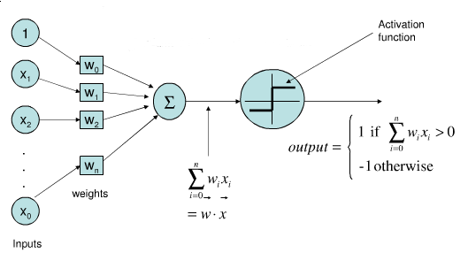
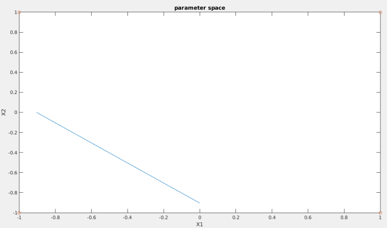
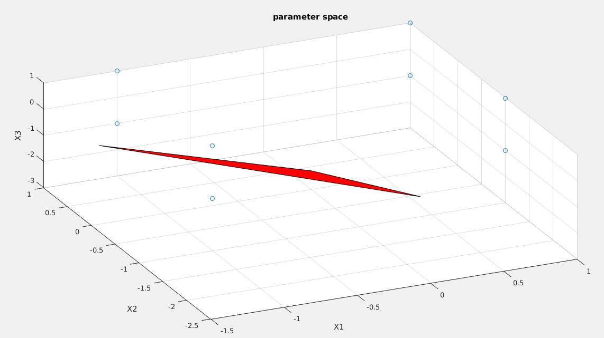

# Implementation of a single layer perceptron

| Perceptron  | 
| -------------    | 
|  | 

Implementing 2 input OR Gate

| X1 | X2 |Q |
| ------------- | ------------- |------------- |------------- |
| -1            | -1            |-1 | |
| -1            | 1             |1  |                                 |
|  1            | -1            |1  |                                 |
|  1            | 1             |1  |                                 |

Implementing 3 input OR Gate

| result  | 
| -------------    | 
|  | 

## Requirements:
1. MATLAB
