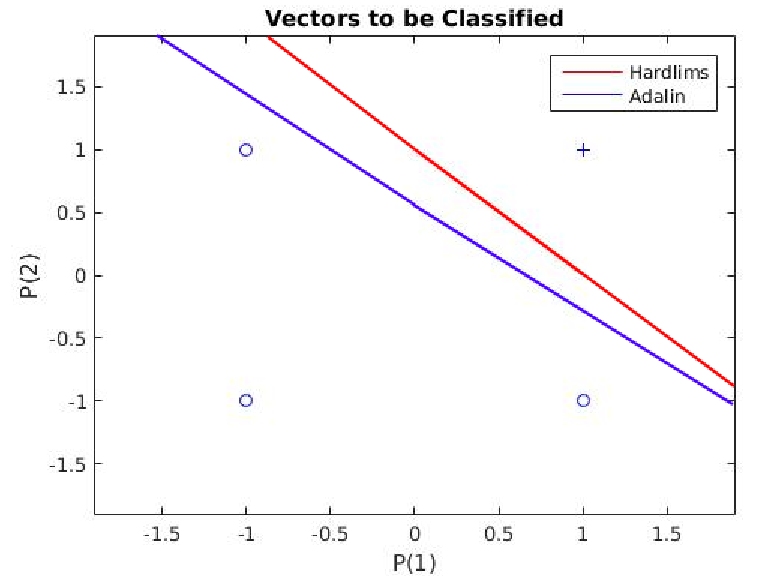

# Comparision of different kinds of perceptrons

| Perceptron  | 
| -------------    | 
|  | 

## ADALINE
Adaptive Linear Neuron(ADALINE) is an early single-layer artificial neural network. It was developed by Professor Bernard Widrow and his graduate student Ted Hoff at Stanford University in 1960(Source: Wikipedia). It is based on the McCulloch–Pitts neuron. It consists of a weight, a bias and a summation function.

The difference between Adaline and the standard (McCulloch–Pitts) perceptron is that in the learning phase, the weights are adjusted according to the weighted sum of the inputs. In the standard perceptron, the net is passed to the activation function and the function's output is used for adjusting the weights. 

## Requirements:
1. MATLAB
