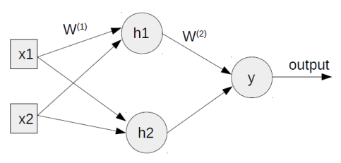
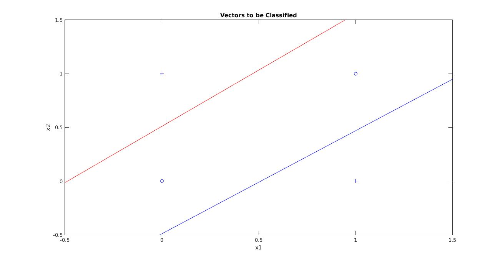

# Multi-Layer Perceptron

| Multi-Layer Architecture  | 
| -------------    | 
|  | 

Implementing 2 input EXOR Gate

| X1            | X2            |            Q |
| ------------- | ------------- |------------- |
|  0            | 0             |0             |    
| 0             | 1             |1             |                                 
|  1            | 0             |1             |                                 
|  1            | 1             |0             |  

| classifying points in parameter space  | 
| -------------    | 
| | width=50 | 

## Requirements:
1. MATLAB
